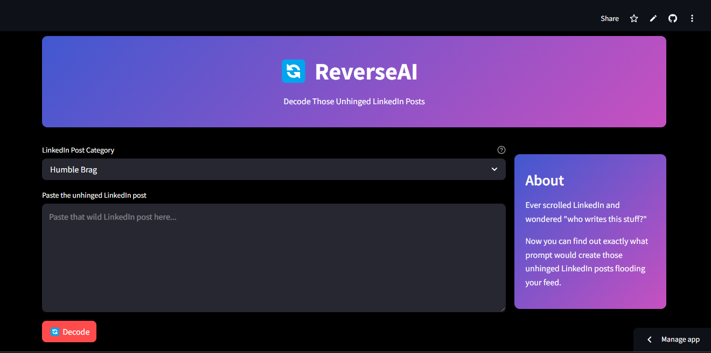

# Reverse AI 🔄

## Decode Those Unhinged LinkedIn Posts

Reverse AI analyzes LinkedIn content and reveals the likely prompts used to generate it. Perfect for understanding content creation patterns or satisfying your curiosity about those engagement-focused posts filling your feed.

## Features

- **Instant Analysis**: Paste any LinkedIn post text and get back the probable AI prompt
- **Simple Interface**: Clean, user-friendly design built with Streamlit
- **Powered by Gemini**: Utilizes Google's Gemini API for accurate prompt reconstruction

## Getting Started

App Link : https://reverse-ai.streamlit.app/

## How It Works

1. **Input**: User pastes LinkedIn post content
2. **Analysis**: Gemini API processes the content using prompt pattern recognition
3. **Output**: The app displays the most likely prompt used to generate the content

## Contributing

Contributions are welcome! Please feel free to submit a Pull Request.
